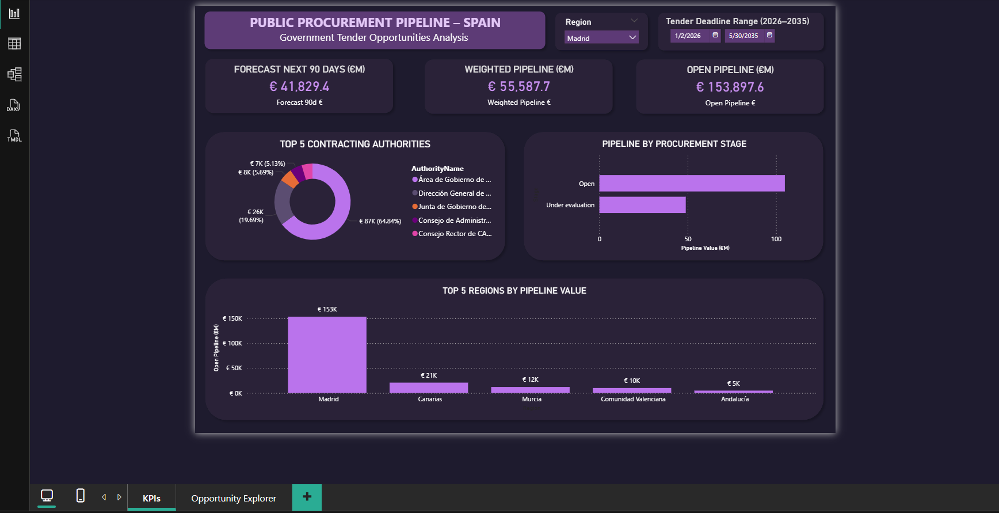
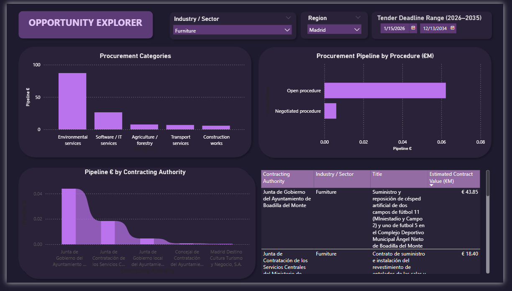

# ⭐ Spain Public Procurement Dashboard

Power BI portfolio project focused on identifying real procurement opportunities in Spain.

---

Most public procurement data is complex, fragmented, and difficult to interpret.

This dashboard transforms raw tender data into a clear, business-oriented view to help identify where real opportunities exist.

---

### What you can see

• Where public spending is concentrated  
• Which sectors have the strongest pipeline  
• Top contracting authorities  
• Regional distribution of opportunities  

---

### Dashboard pages

**Pipeline Overview**  
Key KPIs and high-level procurement activity  

**Opportunity Explorer**  
Interactive analysis by sector, region and deadline  

---

---

### Key takeaway

Turning complex data into clear insights is what creates real value.

